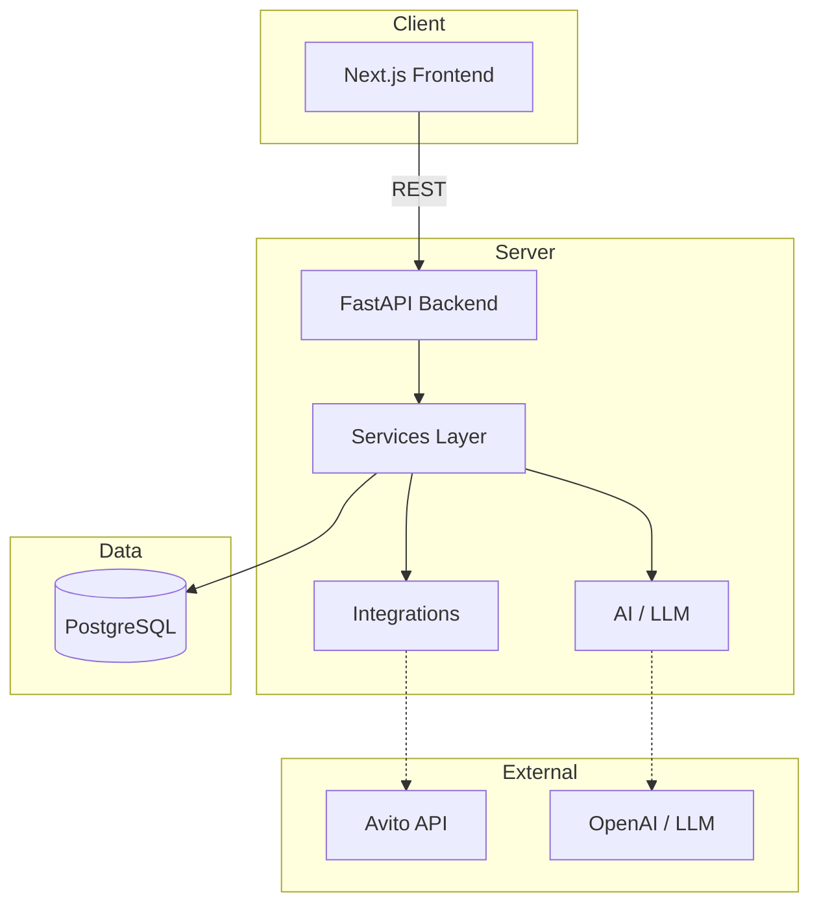

# Архитектура BORIS SaaS

## Обзор

## Слои

| Слой | Ответственность |
|------|-----------------|
| **Frontend** | UI, UX, клиентская логика |
| **Backend** | HTTP API, auth, routing |
| **Services** | Бизнес-логика, доменные правила |
| **AI** | LLM-запросы, промпты, AI-задачи |
| **Integrations** | Внешние API (Avito и др.) |
| **Database** | Хранение данных (PostgreSQL) |

## Поток запроса

1. Пользователь → Frontend (Next.js)
2. Frontend → Backend API (FastAPI)
3. Backend → Service layer (бизнес-логика)
4. Service → Database / AI / Integrations
5. Ответ возвращается по цепочке обратно

## Деплой

Все сервисы оркестрируются через `docker/docker-compose.yml`.
